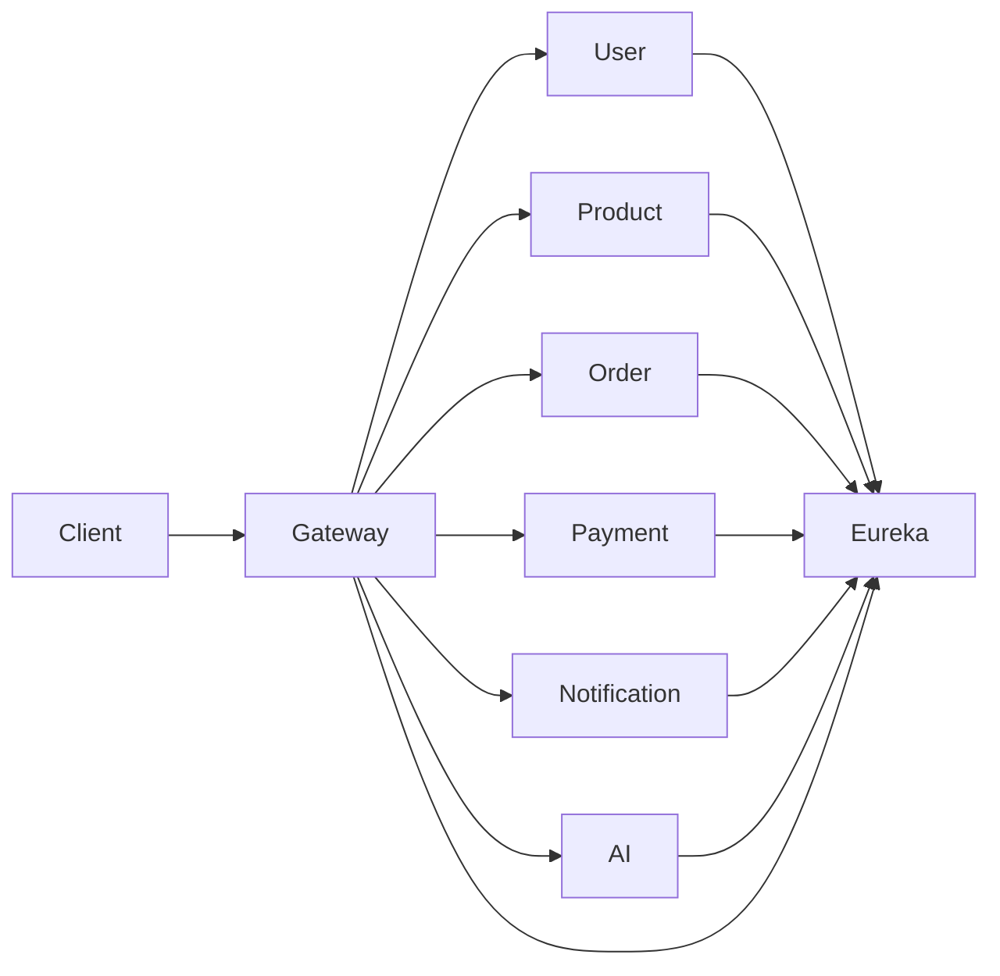

# 🛒 E-Commerce Microservices Platform

A scalable **E-Commerce backend system** built using **Spring Boot 3.2.5** and **Java 21**, following a modern microservices architecture.

---

## 🚀 Tech Stack

- **Backend:** Spring Boot 3.2.5  
- **Language:** Java 21  
- **Architecture:** Microservices  
- **Service Discovery:** Eureka Server  
- **API Gateway:** Spring Cloud Gateway  
- **Containerization:** Docker & Docker Compose  

---

## 🧩 Microservices

| Service               | Port  | Description |
|----------------------|------|------------|
| Eureka Server        | 8761 | Service registry & discovery |
| API Gateway          | 8080 | Entry point for all requests |
| User Service         | 8081 | User management |
| Product Service      | 8082 | Product catalog |
| Order Service        | 8083 | Order processing |
| Payment Service      | 8084 | Payment handling |
| Notification Service | 8085 | Notifications (email) |
| AI Service           | 8086 | AI features (recommendations, etc.) |

---

## 🔄 Architecture Flow



---

## ⚙️ How It Works

- All services register themselves with **Eureka Server**
- **API Gateway** routes requests to respective services
- Services communicate via REST APIs
- Each service is independently deployable
- Docker ensures consistent environment

---

## 🐳 Run the Project

### Prerequisites
- Docker installed  
- Docker Compose installed  

### Start All Services

```bash
docker-compose up --build
```

---

## 🌐 Access

- Eureka Dashboard → http://localhost:8761  
- API Gateway → http://localhost:8080  

---

## 📁 Project Structure

```
ecommerce-microservices/
│
├── eureka-server/
├── api-gateway/
├── user-service/
├── product-service/
├── order-service/
├── payment-service/
├── notification-service/
├── ai-service/
├── docker-compose.yml
└── README.md
```

---

## 📦 Features

- ✅ Microservices architecture  
- ✅ API Gateway routing  
- ✅ Service discovery (Eureka)  
- ✅ Dockerized setup  
- ✅ AI service integration  
- 🔐 JWT Authentication 

---


